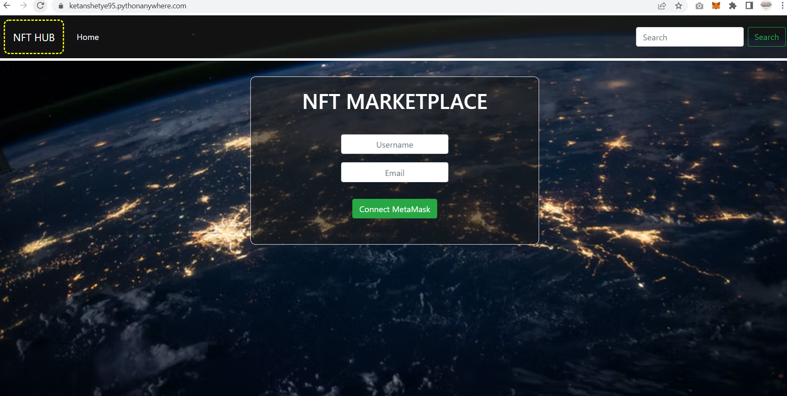
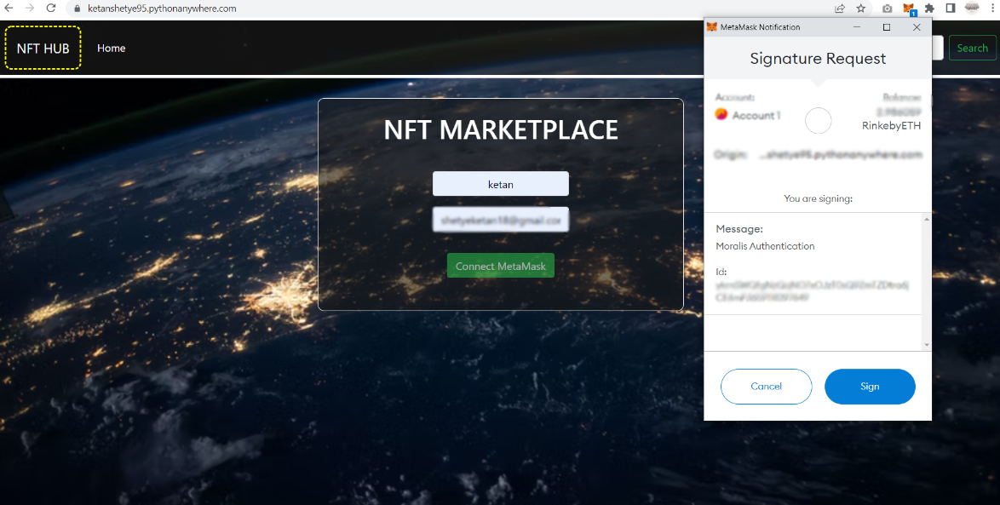
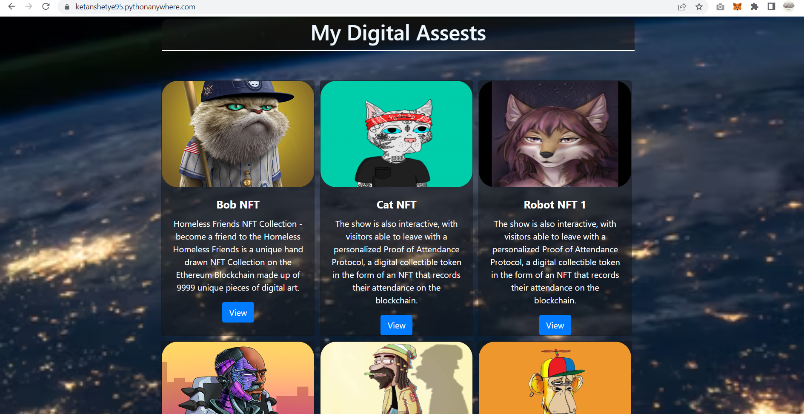
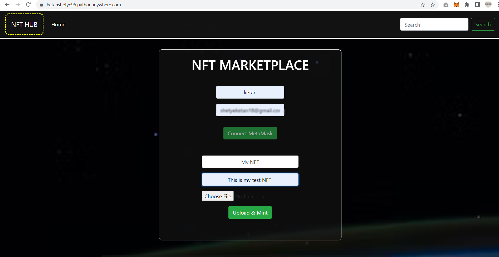
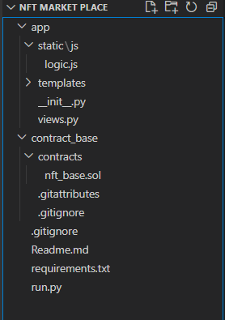

# Simple-Nft-MarketPlace-Website
A simple website for uploading &amp; accessing NFTs with support from Moralis Framework for web3 development.


## My NFT Hub
---
### Actual implementation can be accessed here :
##### https://ketanshetye95.pythonanywhere.com/


### Technologies Used :
```
1. Web3 development
2. Metamask
3. NFT 
4. Opensea API
5. Moralis Framework
6. Blockchain testnets
7. Python,JS,Solidity,HTML,CSS
8. IPFS
```

### Dependencies :
```
1. Must have Metamask wallet installed
2. Must have  testnet account in wallet
3. Must have some ETH balance in testnet wallet OR generate from faucets
```


### Home Page :


```
1. Enter Username & Email-id (optional)
2. Connect to Metamask wallet for entering into web3 world
```

### Metamask Sign in :


```
1. If you have Metamask installed then it will promted to get permissions
2. Make sure to select testnet account address while signing in , which must have sime ETH balance in int
3. If don't have enough balance then can use faucets to generate some

```

### My Digital Assets :


```
1. Once you successfully login , you can view all the NFTs attached to this respective address
```

### Mint NFT :


```
1. Mention Name of NFT
2. Mention Description of NFT
3. Upload the NFT image
4. Metamask will be prompted if everything is correct , just give the required permission and your NFT will be minted
5. to view your latest minte NFT , login again & click on view button , you will be redirected to Opensea test network 
```

### Deploying instructions :

1. Make sure you have **deployed the contract** in "contract_base\contracts\nft_base.sol"
2. **save**/note down the deployed **contract address** for future us
3. make sure to supply tha address in **var nft_contract_address** inside file "app\static\js\logic.js" 
4. Create an account on Moralis framework & create Dapp to get credentials
5. make sure to supploy required **Moralis details** inside file "app\static\js\logic.js" 
6. create python virtual env & activate it
7. pip install -r requirements.txt --user
8.  python run.py
9.  can access app on - http://127.0.0.1:5000/
10.  Play with it


### App Stucture :


### logic.js explanation :
```
Moralis.initialize(""); 
Moralis.serverURL = "";
```
Moralis frame work details for connecting with their platform.

```
const nft_contract_address = "" ;
```
smart contract address you get after its deployed.

```
async function login() {}
```
1. Access metamask
2. Authenicate using Moralis framework
3. If successfully logged-in , generate current users Digital Assets

```
async function upload()
```
1. Convert image to Moralis file format
2. Upload data to IPFS
3. Upload metadat to IPFS
4. Get URL from IPFS
5. mint the NFT

```
function mintToken(_uri)
```
1. get AI from contract 
2. access contract's minting function & supply URL received from IPFS
3. mint the NFT to smart contract

```
function notify(_txt)
```
notify user after NFT successfully minted on testnet.

```
async function getOpenSeaElements() 
```
1. get current user address
2. generate opensea link
3. acquire all digital ssets 
4. showcase assests on webpage

